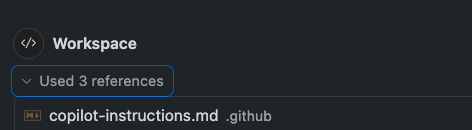

This is a [Next.js](https://nextjs.org) 14 project bootstrapped with [`create-next-app`](https://nextjs.org/docs/app/api-reference/cli/create-next-app).

❗**Note**: No mastery of JavaScript or Next.js is needed, AI will generate most of the code for you in this exercise.
Even if you are not very familiar, it’s a great opportunity to leverage AI to quickly learn a new popular framework.


# Pre-requisites
1. An active Github Copilot license (one of the paid tiers, not the free version).
2. Install and Update Github Copilot & Github Copilot Chat extensions in your IDE.
3. Login to GitHub Copilot and make sure you get both code completions in the editor and chat interactions working.
4. Install [Node.js](https://nodejs.org/en/download) & npm, if not already installed. To verify run ```node -v``` and ```npm -v``` commands.

## Getting Started

First, run the development server:

```bash
npm run dev
# or
yarn dev
# or
pnpm dev
# or
bun dev
```
# App Description

Introducing GitHub Copilot, your dedicated NBA companion! GC brings you live NBA results and a unique feature: concise summaries of press conferences and post-game insights. Stay updated with key takeaways, player quotes, and team strategies, all in one place.

With real-time updates and customizable notifications, GC is perfect for fans who want the latest NBA action and insider perspectives on each game’s impact and team dynamics.

# Instructions

## Task 0 - Choose Your AI Model for GitHub Copilot Chat
1. In GitHub Copilot Chat -> Model Selector drop-down
2. Select **Claude 3.5 Sonnet**
3. 

## Task 1 - Copilot Sport Application with GitHub Copilot

1. **Imagine you are a new developer who just joined the team. You need to explore the project and understand its main components**

   - Open the github.com platform and access your repository
   - Click on the GitHub Copilot icon to open a chat
   - Explore the app by asking a questions like:
      - Can you tell me about this repository? 
      - What framework is this repository using? 
      - Where are the API routes handled?
      - Which API routes are included in this repository?
      - Where are the main UI components?
      - What packages does the app use?

---

2.  **Clone the repository to your local environment and run the application**   
    - Clone the repository
    - Open the repository in your IDE.
    - Open the terminal -> View -> Terminal.
    - Install the npm packages - in the root app folder run ```npm install``` in the terminal to install all necessary packages
    - Start the development server by running ```npm run dev ```
    - Open [http://localhost:3000](http://localhost:3000) in your browser to see the result.

---

3. **Role Prompting:**
   
   GitHub Copilot Chat role prompting is a feature that allows developers to define a specific role for Copilot, guiding it to provide more relevant and context-aware assistance. By setting a role prompt, you outline your development goals, project context, and specific tasks, so Copilot tailors its suggestions, code snippets, and guidance to better match your needs. This makes Copilot’s responses more effective, particularly in complex projects or when working with specialized tools or frameworks.
   - Open GitHub Copilot Chat 
   - Prompt: 
   ```
   You are a developer working on a project using Next.js 14. You should be familiar with modern React practices, Next.js’s routing and app directory structure, API routes, and state management. Your tasks involve building efficient, scalable, and user-friendly applications with a focus on performance and responsiveness.
    Responsibilities:
    - UI Components: Build reusable, accessible, and responsive UI components using the latest Next.js conventions and best practices.
    - API Integration: Set up API routes, handle data fetching with SWR or other libraries, and optimize for performance.
    - Optimized Routing: Implement dynamic and nested routing, leveraging Next.js 14 features for route groups, layouts, and parallel routes.
    - Performance Optimization: Use Next.js optimizations, such as lazy loading and server-side rendering, to ensure fast loading and seamless user experiences.
    - Debugging & Testing: Use GitHub Copilot to generate code suggestions, debug issues, and write tests. Familiarity with testing libraries like Jest and React Testing Library is expected.
    
    Goals with GitHub Copilot Chat:

    - Code Assistance: Use Copilot to suggest improvements, refactor code, and speed up repetitive tasks.
    - Documentation: Generate documentation for components and API routes to ensure maintainability.
    - Error Resolution: Ask Copilot for troubleshooting advice or assistance with specific Next.js 14 features or configurations.
    - Optimization Suggestions: Seek suggestions for optimizing components, reducing bundle size, and improving server and client performance.
    ```

---

4. **Explore NextJS technology with GitHub Copilot participants**
  
   ❗**Note**: Web search tool works best with GPT-4o - please switch the model
   
   - GitHub Copilot provides the ability (using @github participant) to search within your repository or across the web using Bing search integration. Feel free to ask additional questions to deepen your understanding of Next.js 14 technology.
   - Open GitHub Copilot Chat
   - Manually write the following prompts, one by one (do not copy-paste): 
      - ```@github How do I create an API route in Next.js 14?```
      - ```@github What are Server Actions in Next.js 14?```
      - ```@github How does the routing system work in Next.js 14?```
      - ```@github How to create a ui component in Next.js 14?```  
   > In VS Code you can specify @github #web to search the internet with bing.
   
   You can tell that Copilot chat used bing search if you see bing as search resource:

   

   > Troubleshoot: Web search tool works best with GPT-4o - please switch the model. If for some reason you still can't see Bing used in the references, try to prompt it with "@github search the web, how do I..."
---

5. **Custom instructions** 
   
❗**NOTE**: Supported Only in VS Code and Visual Studio❗
   
   You can enhance Copilot's chat responses by providing it with contextual details about your team's workflow, tools, or project specifics. Instead of manually including this context in every chat query, you can create a custom instructions file that automatically incorporates this information **with every chat request**.
   - In the root of your repository, create a file named ```.github/copilot-instructions.md```
     Create the .github directory if it does not already exist.
   - Add natural language instructions to the file, in Markdown format.
     Whitespace between instructions is ignored, so the instructions can be written as a single paragraph, each on a new line, or separated by blank lines for legibility
   - Instructions: 
     - ```For API routes, use Next.js 14's enhanced API route capabilities. Aim for suggestions that optimize data fetching from our backend services, like fetching game data and user statistics, while keeping it secure and performant.```
     - ```Always include comments with code suggestions.```
     - ```Incorporate error handling in all suggestions, with clear messaging for potential issues and recovery steps to ensure a robust and user-friendly application```
   - In the next task, you'll see how these instructions are used as reference
---

6. **Add Comments to Code:** 
   
   One of the common frustrations for developers is documenting their code properly, but don’t worry—Copilot is here to help!:
   - Open /src/app/api/nba-results/route.ts
   - Use GitHub Copilot Chat to gain insights into the code. Simply select the code and choose the /explain option for a detailed breakdown.
   - Select the entire function, then press cmd+i on MacOS or ctrl+i on Windows. Next, type /doc.
    > GitHub Copilot will generate a documentation-style function declaration.
   - You can also use Copilot Chat to generate additional documentation. Open GitHub Copilot Chat and enter a prompt: ```Add comments to my code```
   - Add /doc and comments to other api routes
   > When adding comments to the code, ensure that GitHub Copilot Chat applies custom instructions with each request.

   

---
  
7. **Fix your code with GitHub Copilot**
   
   GitHub Copilot assists in fixing code errors by analyzing context to suggest corrections, improving code accuracy and reducing debugging time. It quickly identifies and offers solutions for syntax errors, logic issues, and common mistakes.
   - In the website's UI, navigate to the errors page at http://localhost:3000/errors - this is actually an 'Add NBA player' page, although, when trying to create a new player, there's an error
   - Fill in the form and click on 'Create player' button - you will see an error (404) displayed both in the the IDE console and in the website UI (browser console).
   - Ask Copilot Chat to /explain the error "/explain POST /api/players 404", with the context of /errors/page.tsx
   - Ask Copilot Chat to fix the error with the right context (ask to create the api, while providing the page and players data file - /src/lib/player-info.ts)
   - You should now be able to add players (look at /src/lib/player-info.ts to see the new added player).
   - Once you've fixed the error, enhance the form component's style by selecting the form (in /errors/page.tsx), pressing Ctrl + I on Windows or Cmd + I on MacOS, and asking Copilot to improve the style using TailwindCSS.
   - See the results.

---

8. **Optimize Code With GitHub Copilot**
    
    GitHub Copilot Chat can help you optimize code (refactor behavior without changing functionallity). In the following task, you will optimize 2 inefficient code logics, using different Chat models.
    
    - Optimize with GPT 4o:
      - Click on 'Optimization' page in the web app. left menu 
      - Wait until the page finishes loading (might take ~10s).
      - Your goal is to optimize the code using the GPT 4o model
      - Find the API route in the code (you can use #codebase to help locate it).
      - **Choose chat model GPT-4o**
      
      
      - Ask Copilot Chat to "optimize this code" while the relevant route.ts is in the chat context.
      - Make the necessary adjustments, then reload the page and make sure it loads fast.

   - Optimize with o3 model:
      - Click on 'Optimization-o1' page in the web app. left menu 
      - Wait until the page finishes loading
      - Your goal is to optimize the code using the o3 (preview) model
      - Find the API route in the code (you can use #codebase to help locate it).
      - Select the countTokens function code and open inline chat (press ctrl+i (windows) / cmd + i (macos)) and **switch to o3 (preview) model**
      - Type /optimize
      - Make the necessary adjustments, then try accessing the page again
      
      > Did you know? 
      **o3 (preview)** model is focused on advanced reasoning and solving complex problems, in particular in math and science. It responds more slowly than the GPT-4o model.
      **o3-mini** model is the next generation of reasoning models, following from o1 and o1-mini. The o3-mini model outperforms o1 on coding benchmarks with response times that are comparable to o1-mini, providing improved quality at nearly the same latency. It is best suited for code generation and small context operations

---

9. **GitHub Copilot Code Reviews**
   
   ❗**NOTE**: Supported Only in VS Code❗

   GitHub Copilot can review your code and provide feedback. Where possible, Copilot's feedback includes suggested changes which you can apply with a couple of clicks.
   - Open the /app/api/nba-results/route.ts file 
   - Select all this file code, Right-click mouse on the code, Choose menu 'Copilot -> Review and Comment'
   - GitHub Copilot will suggest code improvements, which you can choose to accept, reject, or skip to move on to the next suggestion. You'll also find the complete suggestions in the comments section.

   

---

10. **Generate Unit Tests using GitHub Copilot**
   Test-driven development and unit test creation aren't always prioritized by development teams. However, GitHub Copilot can significantly reduce the effort required for these tasks by automatically generating unit tests.
   - Open the /util/calculator.js file located in the /src directory.
   - The file contains simple calculator util functions
   - Open the /util/calculator.test.js file and add unit tests to calculator.js by using Jest and prompt engineering techniques, such as the one-shot method. Provide a sample unit test structure example in Copilot Chat to guide the model, then proceed to generate the tests.
   - You can generate tests also by typing /tests participant in GitHub Copilot Chat
   - Run the tests using the command ```npm test src/util/calculator.test.js```
   - Fix one failing test by copying the terminal error into Copilot Inline Chat (press ctrl+i (windows) / cmd + i (macos)), highlighting the failing test code and using the /fix command

---

11. **Lets Create a Player info feature, Under lib folder there is a a file called player-info.ts with nba player stats, you need to build an api route and react component based on player stats using file attach option in the chat, the route already exists under /src/app/api/player-info/route.ts**

❗**NOTE**: Use Copilot Edits in VS Code and Visual Studio, in Jetbrains IDEs use Copilot Chat instead❗
   
   - In GitHub Copilot Chat, use @github chat participant to learn how to handle routes in a Next.js 14 application.
   - Add the 3 relevant files to the Chat context (attach files or drag&drop):       
      1. /src/app/api/player-info/route.ts  - api to fetch players data
      2. /src/lib/player-info.ts - players data
      3. /src/app/(dashboard)/player-info/page.tsx - players info page

   - Now ask Copilot Edits (or Copilot Chat in JetBrains IDEs) to: 
   
      Create a route based on the player-info file that fetches only the id, name, team, weight, height, and position properties. Generate a component that displays a list of player information with all these fields, Ensure each player is displayed in a separate card. Use Tailwindcss and shadcn in your prompt to style the output

   - You can test your api route with GET request: http://localhost:3000/api/player-info
   - Open the http://localhost:3000/players-info and see the results, refactor the code if needed. 
  
## Task 2 - Copilot Agent Mode

❗**NOTE**: Supported Only in VS Code❗

1. **Add Stadiums feature using GitHub Copilot Agents** 
    GitHub Copilot’s new agent mode is capable of iterating on its own code, recognizing errors, and fixing them automatically. It can suggest terminal commands and ask you to execute them. It also analyzes run-time errors with self-healing capabilities.
    -  Open GitHub Copilot Chat, select Copilot Edits Tab, from the drop down menu select Agent mode and select Claude 3.5 Sonnet model.
    -  Include a prompt to generate a new Stadium feature—clearly specify the exact instructions for your desired action. For example:
       
      ```
      Let's enhance this application by adding an NBA Stadiums page.
       1. First, create a JSON file containing sample stadium data.
       2. Then, set up a Next.js API route to serve the stadium data from the JSON file.
       3. Build a React component that displays the stadium information as cards.
       4. Add a navigation link to this new component in the main navigation page.
       5. Use Tailwind CSS and ShadCN components to style the UI.
     ```
     - Review the output and monitor live changes in your codebase. The agent will analyze your file structure, determine appropriate locations for adding files, and handle the additions accordingly. Be sure to accept or reject each step suggested by the agent.
     - Open the app to verify that the Stadiums navigation tab, the REST API endpoint, and the corresponding React component have been successfully added.

2.  **Add a login screen using Github Copilot Vision**
     You can now attach images and work with them directly in Copilot Chat. Share screenshots of errors and Copilot will interpret the image and resolve the issue. Or share mockups of new designs, and Vision will help you bring them to life.
     - Open the Copilot Chat and select Gpt-4o model 
     - Navigate to the image folder located at the root of your project, select the login.png file, and attach it to your chat.
     - Now, create a React login component based on the attached image. For example: ```Write a React component code based on login.png image```
     - Optionally, you can activate agent mode to build the complete flow.
     - Integrate the component into your application.

3.  **Bonus - change UI using Github Copilot Vision**
     - Open the Copilot Chat and select Gpt-4o model 
     - Get some common UI you like and ask your agent to make your application as similar as possible.
  
## Task 3 - MCP Servers (Bonus)

❗**NOTE**: Supported Only in VS Code IDE❗

# Pre-requisites
- Docker Running
- GitHub PAT (Personal Access Token)

1. **Enable Agent mode if not already enabled:**
   - File - > Preferences -> Settings -> search 'agent' and enable the feature
   - If it doesn't work - Restart/Update VS Code

2.  **Activate MCP**
     - File -> Preferences -> Settings -> search 'MCP' and enable the feature
  
3.  **Add GitHub MCP Server**
     - File -> Preferences -> Settings -> search 'MCP' and click 'edit in settings.json'
       > Note: You can also switch to agent mode -> choose the tools icon -> Add More Tools... -> Add MCP Server... -> continue to choose the right option for the desired MCP server

4.  **Add the following (if there are additional mcp servers, add only the relevant code blocks)**
```{
  "mcp": {
    "inputs": [
      {
        "type": "promptString",
        "id": "github_token",
        "description": "GitHub Personal Access Token",
        "password": true
      }
    ],
    "servers": {
      "github": {
        "command": "docker",
        "args": [
          "run",
          "-i",
          "--rm",
          "-e",
          "GITHUB_PERSONAL_ACCESS_TOKEN",
          "ghcr.io/github/github-mcp-server"
        ],
        "env": {
          "GITHUB_PERSONAL_ACCESS_TOKEN": "${input:github_token}"
        }
      }
    }
  }
}
```

5.  **Refresh the tools and enter the GitHub PAT**
     - Go to the agent mode window -> click the server icon
     - A field will appear asking for your GitHUB Personal Access Token -> Enter it
  
6.  **Use GitHub MCP tools**
     - Prompt the agent! Here is an example prompt:
     ```Create a new GitHub repository with the name - agent-demo, make sure it's private.
        To this new repo, create a new branch which I would be the owner of, named - agent-branch.
        Then push this project to the agent-branch and create a new pull request which I would be the owner of, in the new repository you just created. Call it - first PR. Main branch is the base.
        ```
> Note: You can review all GitHub MCP Server available tools here: https://github.com/github/github-mcp-server

## Task 4 - Build your own MCP Server (Bonus)
In this tutorial, we'll build a simple MCP weather server.
We'll start with a basic setup, and then progress to more complex use cases. 

### What we'll be building
Many LLMs do not currently have the ability to fetch the forecast and severe weather alerts. Let's use MCP to solve that!

We'll build a server that exposes two tools: `get-alerts` and `get-forecast`. Then we'll connect the server to an MCP host (in this case, GitHub Copilot in VS Code): 


### Core MCP Concepts

MCP servers can provide three main types of capabilities:

1. **Resources**: File-like data that can be read by clients (like API responses or file contents)
2. **Tools**: Functions that can be called by the LLM (with user approval)
3. **Prompts**: Pre-written templates that help users accomplish specific tasks

This tutorial will primarily focus on tools.
Let's get started with building our weather server! [You can find the complete code for what we'll be building here.](https://github.com/modelcontextprotocol/quickstart-resources/tree/main/weather-server-typescript)

### System requirements
 * Latest version of Node installed

### Set up your environment

First, let’s install Node.js and npm if you haven’t already. You can download them from nodejs.org. Verify your Node.js installation:
```node --version
npm --version
```
For this tutorial, you’ll need Node.js version 16 or higher.

Now, let's create and set up our project:

```bash MacOS/Linux
# Create a new directory for our project
mkdir weather
cd weather

# Initialize a new npm project
npm init -y

# Install dependencies
npm install @modelcontextprotocol/sdk zod
npm install -D @types/node typescript

# Create our files
mkdir src
touch src/index.ts
```

```powershell Windows
# Create a new directory for our project
md weather
cd weather

# Initialize a new npm project
npm init -y

# Install dependencies
npm install @modelcontextprotocol/sdk zod
npm install -D @types/node typescript

# Create our files
md src
new-item src\index.ts
```
Update your package.json to add type: “module” and a build script:
```{
  "type": "module",
  "bin": {
    "weather": "./build/index.js"
  },
  "scripts": {
    "build": "tsc && chmod 755 build/index.js"
  },
  "files": [
    "build"
  ],
}
```
Create a tsconfig.json in the root of your project:
```{
  "compilerOptions": {
    "target": "ES2022",
    "module": "Node16",
    "moduleResolution": "Node16",
    "outDir": "./build",
    "rootDir": "./src",
    "strict": true,
    "esModuleInterop": true,
    "skipLibCheck": true,
    "forceConsistentCasingInFileNames": true
  },
  "include": ["src/**/*"],
  "exclude": ["node_modules"]
}
```

Now let's dive into building your server.

## Building your server

### Importing packages and setting up the instance

Add these to the top of your src/index.ts:

```typescript
import { McpServer } from "@modelcontextprotocol/sdk/server/mcp.js";
import { StdioServerTransport } from "@modelcontextprotocol/sdk/server/stdio.js";
import { z } from "zod";

const NWS_API_BASE = "https://api.weather.gov";
const USER_AGENT = "weather-app/1.0";

// Create server instance
const server = new McpServer({
  name: "weather",
  version: "1.0.0",
  capabilities: {
    resources: {},
    tools: {},
  },
});
```

### Helper functions

Next, let's add our helper functions for querying and formatting the data from the National Weather Service API:

    ```typescript
// Helper function for making NWS API requests
async function makeNWSRequest<T>(url: string): Promise<T | null> {
  const headers = {
    "User-Agent": USER_AGENT,
    Accept: "application/geo+json",
  };

  try {
    const response = await fetch(url, { headers });
    if (!response.ok) {
      throw new Error(`HTTP error! status: ${response.status}`);
    }
    return (await response.json()) as T;
  } catch (error) {
    console.error("Error making NWS request:", error);
    return null;
  }
}

interface AlertFeature {
  properties: {
    event?: string;
    areaDesc?: string;
    severity?: string;
    status?: string;
    headline?: string;
  };
}

// Format alert data
function formatAlert(feature: AlertFeature): string {
  const props = feature.properties;
  return [
    `Event: ${props.event || "Unknown"}`,
    `Area: ${props.areaDesc || "Unknown"}`,
    `Severity: ${props.severity || "Unknown"}`,
    `Status: ${props.status || "Unknown"}`,
    `Headline: ${props.headline || "No headline"}`,
    "---",
  ].join("\n");
}

interface ForecastPeriod {
  name?: string;
  temperature?: number;
  temperatureUnit?: string;
  windSpeed?: string;
  windDirection?: string;
  shortForecast?: string;
}

interface AlertsResponse {
  features: AlertFeature[];
}

interface PointsResponse {
  properties: {
    forecast?: string;
  };
}

interface ForecastResponse {
  properties: {
    periods: ForecastPeriod[];
  };
}```

### Implementing tool execution
The tool execution handler is responsible for actually executing the logic of each tool. Let's add it:

    ```typescript
// Register weather tools
server.tool(
  "get-alerts",
  "Get weather alerts for a state",
  {
    state: z.string().length(2).describe("Two-letter state code (e.g. CA, NY)"),
  },
  async ({ state }) => {
    const stateCode = state.toUpperCase();
    const alertsUrl = `${NWS_API_BASE}/alerts?area=${stateCode}`;
    const alertsData = await makeNWSRequest<AlertsResponse>(alertsUrl);

    if (!alertsData) {
      return {
        content: [
          {
            type: "text",
            text: "Failed to retrieve alerts data",
          },
        ],
      };
    }

    const features = alertsData.features || [];
    if (features.length === 0) {
      return {
        content: [
          {
            type: "text",
            text: `No active alerts for ${stateCode}`,
          },
        ],
      };
    }

    const formattedAlerts = features.map(formatAlert);
    const alertsText = `Active alerts for ${stateCode}:\n\n${formattedAlerts.join("\n")}`;

    return {
      content: [
        {
          type: "text",
          text: alertsText,
        },
      ],
    };
  },
);

server.tool(
  "get-forecast",
  "Get weather forecast for a location",
  {
    latitude: z.number().min(-90).max(90).describe("Latitude of the location"),
    longitude: z.number().min(-180).max(180).describe("Longitude of the location"),
  },
  async ({ latitude, longitude }) => {
    // Get grid point data
    const pointsUrl = `${NWS_API_BASE}/points/${latitude.toFixed(4)},${longitude.toFixed(4)}`;
    const pointsData = await makeNWSRequest<PointsResponse>(pointsUrl);

    if (!pointsData) {
      return {
        content: [
          {
            type: "text",
            text: `Failed to retrieve grid point data for coordinates: ${latitude}, ${longitude}. This location may not be supported by the NWS API (only US locations are supported).`,
          },
        ],
      };
    }

    const forecastUrl = pointsData.properties?.forecast;
    if (!forecastUrl) {
      return {
        content: [
          {
            type: "text",
            text: "Failed to get forecast URL from grid point data",
          },
        ],
      };
    }

    // Get forecast data
    const forecastData = await makeNWSRequest<ForecastResponse>(forecastUrl);
    if (!forecastData) {
      return {
        content: [
          {
            type: "text",
            text: "Failed to retrieve forecast data",
          },
        ],
      };
    }

    const periods = forecastData.properties?.periods || [];
    if (periods.length === 0) {
      return {
        content: [
          {
            type: "text",
            text: "No forecast periods available",
          },
        ],
      };
    }

    // Format forecast periods
    const formattedForecast = periods.map((period: ForecastPeriod) =>
      [
        `${period.name || "Unknown"}:`,
        `Temperature: ${period.temperature || "Unknown"}°${period.temperatureUnit || "F"}`,
        `Wind: ${period.windSpeed || "Unknown"} ${period.windDirection || ""}`,
        `${period.shortForecast || "No forecast available"}`,
        "---",
      ].join("\n"),
    );

    const forecastText = `Forecast for ${latitude}, ${longitude}:\n\n${formattedForecast.join("\n")}`;

    return {
      content: [
        {
          type: "text",
          text: forecastText,
        },
      ],
    };
  },
);```

### Running the server
Finally, let's initialize and run the server:

    ```typescript
async function main() {
  const transport = new StdioServerTransport();
  await server.connect(transport);
  console.error("Weather MCP Server running on stdio");
}

main().catch((error) => {
  console.error("Fatal error in main():", error);
  process.exit(1);
});```

Make sure to run npm run build to build your server! This is a very important step in getting your server to connect.

Let's now test your server from an existing MCP host, GitHub Copilot in VS Code.

## Testing your server with GitHub Copilot in VS Code

   Enable Agent mode if not already enabled:
   - File -> Preferences -> Settings -> search 'agent' and enable the feature
   - If it doesn't work - Restart/Update VS Code

    Activate MCP:
    - File -> Preferences -> Settings -> MCP -> Enable

    Add Weather MCP Server:
    File -> Preferences -> Settings -> MCP -> Edit in settings.json

    Add the following (if there are additional mcp servers, add only the relevant code blocks):
    ```{
      "mcp": {
        "servers": {
          "weather": {
            "command": "node",
            "args": [
               "/ABSOLUTE/PATH/TO/PARENT/FOLDER/weather/build/index.js"
            ],
          }
        }
      }
    }
    ```

   This tells GitHub Copilot:
    1. There's an MCP server named "weather"
    2. To launch it by running `node /ABSOLUTE/PATH/TO/PARENT/FOLDER/weather/build/index.js`

## What's happening under the hood
When you ask a question:

1. The client sends your question to GitHub Copilot Agent
2. The Agent mode analyzes the available tools and decides which one(s) to use
3. The client executes the chosen tool(s) through the MCP server
4. The results are sent back to GitHub Copilot Agent
5. GitHub Copilot Agent Mode formulates a natural language response
6. The response is displayed to you!

## Troubleshooting
    **Error: Failed to retrieve grid point data**

    This usually means either:

    1. The coordinates are outside the US
    2. The NWS API is having issues
    3. You're being rate limited

    Fix:

    * Verify you're using US coordinates
    * Add a small delay between requests
    * Check the NWS API status page

    **Error: No active alerts for \[STATE]**

    This isn't an error - it just means there are no current weather alerts for that state. Try a different state or check during severe weather.

## Next steps

    Learn how to build your own MCP client that can connect to your server - https://modelcontextprotocol.io/quickstart/client
    
## Task 5 - Create MCP Server with LLMs (https://modelcontextprotocol.io/tutorials/building-mcp-with-llms)
   - Enter the readme file in - https://github.com/modelcontextprotocol/typescript-sdk, and copy the raw file
   - Create a new file under .github/prompts (in root) folder named- llm-mcp.prompt.md
   - Copy the raw readme content
   - Open GitHub Copilot Agent Mode, add context - prompts -> llm-mcp.prompt.md

   - Ask GitHub Copilot Agent Mode to build your MCP Server. An example prompt:
      ```Build an MCP server that:
      - Connects to my company's PostgreSQL database
      - Exposes table schemas as resources
      - Provides tools for running read-only SQL queries
      - Includes prompts for common data analysis tasks
      ```
