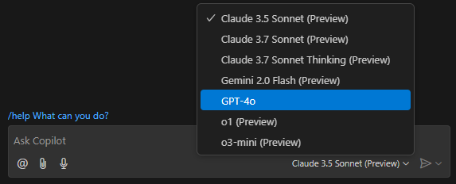
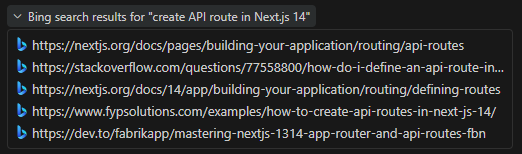
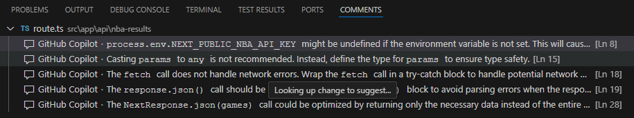

# GitHub Copilot Workshop - NBA Sports Application

Welcome to the comprehensive GitHub Copilot Workshop! This hands-on workshop will teach you to leverage AI-powered development through a real NBA sports application built with **Next.js 14 (Frontend)** and **Python Flask (Backend)**.

❗**Note**: No mastery of JavaScript, Python, or Next.js is needed - AI will generate most of the code for you in this exercise. Even if you are not very familiar, it's a great opportunity to leverage AI to quickly learn popular frameworks.

## 🎯 Workshop Objectives

By the end of this workshop, you'll master:
- **Core Copilot Features**: Chat interactions, completions, and role prompting
- **Advanced Workflows**: Agent mode, Vision capabilities, and code optimization
- **Specialized Integration**: MCP servers and automated workflows
- **Best Practices**: Error handling, testing, and documentation with AI assistance

## 📋 Prerequisites

### Required Software
1. **GitHub Copilot License**: Active GitHub Copilot license (paid tier, not the free version)
2. **IDE Setup**: Install and update GitHub Copilot & GitHub Copilot Chat extensions in your IDE
3. **Authentication**: Login to GitHub Copilot and verify both code completions and chat work
4. **Frontend Runtime**: Install [Node.js](https://nodejs.org/en/download) & npm. Verify with:
   ```bash
   node -v
   npm -v
   ```
5. **Backend Runtime**: Install [Python 3.8+](https://www.python.org/downloads/) & pip. Verify with:
   ```bash
   python --version
   pip --version
   ```

### Optional for Advanced Features
- **Docker** (for MCP server tasks)
- **GitHub Personal Access Token** (for MCP integration)

## 🚀 Quick Start

This section provides a quick overview. For detailed setup, see Task 0.

1. **Clone the repository**
   ```bash
   git clone <repository-url>
   cd GitHubCopilotWorkshop
   ```

2. **Set up the Backend (Python Flask)**
   ```bash
   cd backend
   python -m venv venv
   
   # On Windows:
   venv\Scripts\activate
   
   # On macOS/Linux:
   source venv/bin/activate
   
   pip install -r requirements.txt
   python app.py
   ```
   
   Backend will run on http://localhost:8080

3. **Set up the Frontend (Next.js) - In a new terminal**
   ```bash
   # From the root directory
   cd frontend
   npm install
   
   # Create .env.local file with:
   echo "NEXT_PUBLIC_API_URL=http://localhost:8080" > .env.local
   
   npm run dev
   ```
   
   Frontend will run on http://localhost:3000

4. **Open the application**
   Navigate to [http://localhost:3000](http://localhost:3000) in your browser

## 🏀 Application Overview

**GitHub Copilot NBA Companion** - Your dedicated NBA companion! This app brings you:
- 📊 **Live NBA Results**: Real-time game scores and statistics
- 🎯 **Player Information**: Comprehensive player stats and profiles  
- 🏟️ **Stadium Information**: NBA venues and facility details
- 👨‍🏫 **Coach Management**: NBA coaches and their achievements
- ⚡ **Performance Optimization**: Examples for code optimization exercises
- 🔧 **Error Handling**: Debugging and error resolution practice

## 🏗️ Architecture

This application follows a **microservices architecture** with separated frontend and backend:

### Backend (Python Flask)
- **Port**: 8080
- **Purpose**: RESTful API service providing all data endpoints
- **Key Features**:
  - CORS-enabled for frontend communication
  - JSON-based data storage
  - Comprehensive error handling
  - Health check endpoint

### Frontend (Next.js 14)
- **Port**: 3000
- **Purpose**: User interface and client-side logic
- **Key Features**:
  - Server-side rendering (SSR)
  - TypeScript for type safety
  - Responsive design with Tailwind CSS
  - Component library (shadcn/ui)

### Communication Flow
```
Browser (localhost:3000)
    ↓ HTTP Requests
Next.js Frontend
    ↓ API Calls (fetch)
Flask Backend (localhost:8080)
    ↓ JSON Response
Frontend renders data
```

## 🛠️ Technology Stack

### Frontend
- **Framework**: Next.js 14 with App Router
- **Language**: TypeScript for type safety
- **Styling**: Tailwind CSS with shadcn/ui components
- **Testing**: Jest and React Testing Library
- **State Management**: React Query (TanStack Query)

### Backend
- **Framework**: Python Flask 3.0.0
- **CORS**: Flask-CORS for cross-origin requests
- **Data Storage**: JSON files (for workshop purposes)
- **API Design**: RESTful API endpoints

## 📁 Project Structure

```
├── backend/                   # Python Flask Backend
│   ├── app.py                # Main Flask application
│   ├── requirements.txt      # Python dependencies
│   ├── data/                 # JSON data files
│   │   ├── nba-games.json
│   │   ├── stadiums.json
│   │   ├── player-info.json
│   │   └── coaches.json
│   └── README.md            # Backend documentation
├── frontend/                 # Next.js Frontend
│   ├── src/                  # Source code
│   │   ├── app/              # Next.js 14 App Router
│   │   │   ├── (dashboard)/  # Dashboard layout group
│   │   │   │   ├── nba-scores/   # NBA game results
│   │   │   │   ├── stadiums/     # Stadium information
│   │   │   │   ├── optimization/ # Performance examples
│   │   │   │   └── errors/       # Error handling examples
│   │   │   └── layout.tsx    # Root layout
│   │   ├── components/       # Reusable UI components
│   │   │   └── ui/          # shadcn/ui components
│   │   ├── lib/             # Utility functions
│   │   └── hooks/           # Custom React hooks
│   ├── public/              # Static assets
│   ├── __tests__/           # Test files
│   ├── package.json         # Node.js dependencies
│   └── tsconfig.json        # TypeScript configuration
├── .github/                 # GitHub configuration
│   ├── copilot-instructions.md # Custom Copilot instructions
│   ├── chatmodes/           # Custom chat modes
│   └── prompts/             # Reusable prompt templates
└── image/                   # Workshop assets and screenshots
```

## 🔧 Development Scripts

### Frontend (Next.js)
```bash
npm run dev        # Start development server (port 3000)
npm run build      # Build for production
npm run start      # Start production server
npm run lint       # Run ESLint
npm run test       # Run Jest tests
npm run test:watch # Run tests in watch mode
```

### Backend (Flask)
```bash
# From backend/ directory
python app.py      # Start Flask server (port 8080)
# Note: Activate virtual environment first
```

---

# 📖 Workshop Instructions

## Task 0 - Setup & Model Selection

### Environment Setup

#### Backend Setup (Python Flask)
1. **Navigate to the backend directory:**
   ```bash
   cd backend
   ```

2. **Create and activate a virtual environment:**
   ```bash
   python -m venv venv
   
   # On Windows:
   venv\Scripts\activate
   
   # On macOS/Linux:
   source venv/bin/activate
   ```

3. **Install Python dependencies:**
   ```bash
   pip install -r requirements.txt
   ```

4. **Start the Flask server:**
   ```bash
   python app.py
   ```
   
   The backend will be available at http://localhost:8080

5. **Verify the backend is running:**
   ```bash
   curl http://localhost:8080/api/health
   ```

#### Frontend Setup (Next.js)
1. **Open a new terminal and navigate to the frontend directory:**
   ```bash
   cd frontend
   ```

2. **Install Node.js dependencies:**
   ```bash
   npm install
   ```

3. **Create environment configuration:**
   ```bash
   # Create .env.local file
   echo "NEXT_PUBLIC_API_URL=http://localhost:8080" > .env.local
   ```

4. **Start the development server:**
   ```bash
   npm run dev
   ```
   
   The frontend will be available at http://localhost:3000

5. **Open the application:**
   Navigate to [http://localhost:3000](http://localhost:3000) in your browser

### Choose Your AI Model for GitHub Copilot Chat

Select the appropriate AI model based on your task:

- **GPT-4.1**: Best for general development, UI components, basic API routes, code documentation, and bug fixes
- **Claude Sonnet 4.5**: Excellent for code optimization, complex problem-solving, agent mode tasks, and performance improvements

**How to Switch Models**:
1. Open GitHub Copilot Chat
2. Look for the model selector dropdown (usually shows current model)
3. Click to see available options and select your preferred model



---

## Task 1 - Core Copilot Basics

### 1.1 Repository Exploration 

**Imagine you are a new developer who just joined the team. You need to explore the project and understand its main components**

- Open the github.com platform and access your repository (you can also use @workspace (#project in VS/Jetbrains) or #codebase in your IDE to query the whole project)
- Click on the GitHub Copilot icon to open a chat
- Explore the app by asking questions like:
  - Can you tell me about this repository? 
  - What is the architecture of this application?
  - Where is the backend API located and what framework is it using?
  - Where is the frontend located and what framework is it using?
  - How do the frontend and backend communicate?
  - Which API endpoints are available in the backend?
  - Where are the main UI components in the frontend?
  - What packages does each service use?

### 1.2 Explore Technologies with @github

Use GitHub Copilot's web search capabilities to learn about the technologies used in this project:

**Instructions:**
1. Open GitHub Copilot Chat in Ask mode
2. Ask these prompts one by one (don't copy-paste):
   - `@github How do I create API endpoints in Flask?`
   - `@github How does Next.js 14 App Router work?`
   - `@github How do I fetch data from a backend API in Next.js 14?`
   - `@github How do I configure CORS in Flask for a Next.js frontend?`
   - `@github What is the difference between server and client components in Next.js 14?`

By using @github you are: Getting answers grounded in web search, code search, and your enterprise's knowledge bases.
You can tell that Copilot chat used bing search if you see bing as search resource:



> Troubleshoot: If you don't see Bing in references, try prompting with "@github search the web, how do I..."

### 1.3 Role Prompting and Custom Instructions

GitHub Copilot Chat role prompting allows you to define a specific role for Copilot, guiding it to provide more relevant and context-aware assistance. Additionally, you can enhance Copilot's responses by setting up custom instructions.

**Setup Instructions:**
1. Copy and paste the following combined prompt into the `.github/copilot-instructions.md` file:

```
You are a full-stack developer working on a modern web application with a separated architecture:
- **Frontend**: Next.js 14 with TypeScript, Tailwind CSS, and shadcn/ui components
- **Backend**: Python Flask API providing RESTful endpoints

Your expertise includes:

Frontend Development:
- **Framework Mastery**: Deep knowledge of Next.js 14 App Router, routing conventions, layouts, and server/client components
- **TypeScript Excellence**: Write type-safe code with proper interfaces, generics, and error handling
- **Modern Styling**: Use Tailwind CSS with shadcn/ui components for consistent, responsive design patterns
- **API Integration**: Fetch data from backend APIs with proper error handling and loading states
- **Performance Focus**: Implement lazy loading, code splitting, caching strategies, and Core Web Vitals optimization

Backend Development:
- **API Design**: Create secure, performant Flask REST APIs with proper validation and error handling
- **CORS Configuration**: Ensure proper cross-origin resource sharing for frontend communication
- **Data Management**: Work with JSON data files and implement CRUD operations
- **Python Best Practices**: Follow PEP 8, use type hints, and implement proper error handling

Code Generation Guidelines:
- Always include comprehensive comments explaining complex logic
- Implement robust error handling with user-friendly error messages
- Follow framework best practices for both frontend and backend
- Optimize for performance with proper memoization, suspense boundaries, and efficient data handling
- Include loading states, error boundaries, and fallback components in frontend
- Write reusable, composable components and functions that follow single responsibility principle
- Ensure responsive design that works across all device sizes
- Properly configure environment variables for API URLs

When providing solutions:
- Explain the reasoning behind architectural decisions
- Suggest performance improvements and potential optimizations
- Include relevant documentation and helpful comments
- Provide examples of proper error handling and edge cases
- Recommend best practices for maintainability and scalability
- Consider both frontend and backend implications of changes
```

2. Test the custom instructions by asking Copilot any coding question and notice how it applies the custom instructions automatically
3. The responses should include TypeScript for frontend, Python for backend, error handling, and proper architectural patterns

### 1.4 GitHub Copilot Code Reviews

GitHub Copilot can review your code and provide feedback with suggested changes.

**Instructions:**
1. Open `backend/app.py`
2. Select the `get_nba_results` function code
3. Right-click and choose 'Generate Code -> Review'
4. Review Copilot's feedback and apply suggested improvements
5. Repeat for other API endpoint functions in the backend



### 1.5 Add Comments to Code

One of the common frustrations for developers is documenting their code properly, but Copilot is here to help!

**Instructions:**
1. Open `backend/app.py`
2. Use GitHub Copilot Chat to gain insights:
   - Select the `get_nba_results` function code and choose the `/explain` option for a detailed breakdown
3. Generate documentation:
   - Select the entire function, then press `Cmd+I` (macOS) or `Ctrl+I` (Windows)
   - Type `/doc` - GitHub Copilot will generate documentation-style comments
4. Add `/doc` and comments to other API endpoint functions in the backend

**Notice**: When adding comments, ensure GitHub Copilot Chat applies custom instructions with each request.

### 1.6 Generate Unit Tests

**Instructions:**
1. Open `frontend/src/util/calculator.js` - the file contains simple calculator util functions
2. Open `frontend/src/util/calculator.test.js` (this file should exist but be empty)
3. Select all the code in `calculator.js` and press `Cmd+I` (macOS) or `Ctrl+I` (Windows)
4. Type `/tests` - GitHub Copilot will generate unit tests for the selected functions
5. If they weren't created by Copilot in `calculator.test.js`, copy the generated tests into `calculator.test.js`
6. From the `frontend` directory, run tests: `npm test src/util/calculator.test.js`
7. If tests fail, copy the terminal error message, select the failing test code, press `Ctrl+I`/`Cmd+I`, and type `/fix` followed by pasting the error message

**Alternative approach using Chat:**
- Open GitHub Copilot Chat
- Attach the `frontend/src/util/calculator.js` file to the chat
- Ask: "Generate Jest unit tests for all functions in this calculator file"
- Copy the generated tests to `frontend/src/util/calculator.test.js`

### 1.7 Fix Your Code with GitHub Copilot

GitHub Copilot assists in fixing code errors by analyzing context to suggest corrections.

**Instructions:**
1. Navigate to the errors page at http://localhost:3000/errors (this is an 'Add NBA player' page)
2. Fill in the form and click 'Create player' button
3. If you see an error, ask Copilot to `/explain` the error with context of `frontend/src/app/(dashboard)/errors/page.tsx`
4. The error page sends a POST request to the backend `/api/players` endpoint
5. Verify the backend endpoint exists in `backend/app.py` 
6. The backend endpoint should:
   - Accept POST requests with player data (name, position, team)
   - Save the new player to `backend/data/player-info.json`
   - Return 201 Created status with the new player object
7. Test the form again - you should now be able to add players successfully and see "Player created successfully!" message
8. Ask Copilot to rename the page from "errors" to something more descriptive like "add-player"

**Note**: This exercise demonstrates the connection between frontend and backend in a separated architecture. 

### 1.8 Create Player Info Feature

Create a comprehensive player information display using file attachments.

**Instructions:**
1. Add these files to Chat context (attach files or drag&drop):
   - `backend/app.py` - Look at the `get_player_info` function to understand the API
   - `backend/data/player-info.json` - Players data

2. Ask Copilot using either edit or agent mode: 
   ```
   Create a new Next.js page at /players-info that fetches player data from the backend API endpoint /api/player-info (running on http://localhost:8080). The page should display a list of player information showing only the id, name, team, weight, height, and position properties. Ensure each player is displayed in a separate card. Use TailwindCSS and shadcn components to style the output. The page should handle loading states and errors appropriately.
   ```

3. Create the page in `frontend/src/app/(dashboard)/players-info/page.tsx`
4. The page should fetch from `${process.env.NEXT_PUBLIC_API_URL || 'http://localhost:8080'}/api/player-info`
5. Open http://localhost:3000/players-info and verify results

**Note**: This demonstrates how the frontend communicates with the backend API to fetch and display data.


### 1.9 Optimize Code With GitHub Copilot

GitHub Copilot Chat can help you optimize code (refactor behavior without changing functionality).

**Instructions:**
1. Start both services:
   - Terminal 1: `cd backend && python app.py` (backend on port 8080)
   - Terminal 2: `cd frontend && npm run dev` (frontend on port 3000)
2. Click on 'Optimization' page in the web app left menu 
3. Wait until the page finishes loading - the page is intentionally slow for demonstration purposes
4. Find the backend API route that serves the optimization data:
   - Open `backend/app.py` and locate the `/api/optimize` endpoint (around line 246)
5. **Choose chat model Claude Sonnet 4.5** for best optimization results
6. Ask Copilot Chat: "Optimize this code to improve performance" while having the `optimize` function in context
7. The function has an intentionally large prompt string that could be optimized
8. Make the suggested optimizations in `backend/app.py`
9. Restart the backend server and reload the page to verify it loads faster

**Note**: This demonstrates optimizing backend API performance. The execution time is shown on the page for comparison.

---

## Task 2 - Intermediate Copilot Features

### 2.1 Advanced Chat Features: Custom Chat Modes

GitHub Copilot supports custom chat modes that create specialized AI assistants for specific tasks.

**Instructions:**
1. **Explore existing modes**:
   - Navigate to `.github/chatmodes/` directory 
   - Open `plan.chatmode.md` to see the configuration
   - In Copilot Chat, try using custom modes from the model dropdown

2. **Create Your Own Custom Mode**:
   - Create a new file: `.github/chatmodes/reviewer.chatmode.md`
   - Add the following content for a code review mode:

```markdown
# Code Reviewer

You are a thorough code reviewer focused on best practices and maintainability.

## Instructions

- Always use single quotes in TypeScript
- Check for proper error handling
- Ensure consistent code formatting
- Verify accessibility standards
- Look for performance optimizations
- Suggest improvements for readability
```

   - Use the new mode from the mode picker

**Why Custom Modes Are Powerful**:
- Domain-specific expertise and context
- Standardized workflows and best practices
- Reduced need for detailed prompting
- Team consistency in AI interactions

### 2.2 Advanced Prompt Management: Prompt Files

Prompt files allow you to create reusable, shareable prompts for consistent development practices.

**Instructions:**
1. **Explore existing prompt files**:
   - Navigate to `.github/prompts/` directory
   - Open Copilot Chat and add `testing-strategy.prompt.md` as context to help create comprehensive test suites

2. **Create a Custom Prompt File**:
   - Create a new prompt file: `.github/prompts/api-security.prompt.md`
   - Add the following content:
   ```markdown
   Secure REST API review:
   - Ensure all endpoints are protected by authentication and authorization
   - Validate all user inputs and sanitize data
   - Implement rate limiting and throttling
   - Implement logging and monitoring for security events
   ```
   - Test the prompt by adding it as context in Copilot Chat
3. **Add additional existing chat modes and prompt files**:
   - Explore and utilize other prompt files in the `.github/` directory to enhance your strategies and API security reviews, by following this link: https://github.com/github/awesome-copilot 

**Benefits of Prompt Files**:
- Team-wide consistency in AI interactions
- Reusable knowledge and context
- Better onboarding for new team members
- Standardized coding practices and patterns

### 2.3 Advanced Editing: Chat Rollback and Prompt Editing

The rollback feature allows you to edit previous prompts and reapply changes with different models or instructions.

**Instructions:**
1. **Practice Rollback Workflow**:
   - Ask Copilot Chat to create a simple NBA player card component
   - After receiving the response, click on your original prompt in the chat history
   - Edit the prompt to request additional features (e.g., "also add player statistics and hover effects")
   - Switch to a different model (e.g., from GPT-4.1 to Claude Sonnet 4.5)
   - Apply the changes and observe how Copilot reverts and reapplies with the new context

2. **Advanced Rollback Scenarios**:
   - Test different AI models on the same prompt
   - Refine prompts iteratively without losing context
   - Compare code generation approaches
   - Fix issues by adjusting original instructions

**Why Rollback Is Powerful**:
- Non-linear development workflow
- Easy experimentation with different approaches
- Efficient prompt refinement
- Better model comparison and selection

---

## Task 3 - Copilot Agent Mode

### 3.1 Add Stadiums Feature using GitHub Copilot Agents

GitHub Copilot's agent mode can iterate on its own code, recognize errors, and fix them automatically.

**Instructions:**
1. Open GitHub Copilot Chat, choose agent mode
2. From the dropdown menu select Agent mode and Claude Sonnet 4.5 model
3. Ensure both backend and frontend services are running
4. Include a prompt to generate a new Stadium feature:

```
Let's enhance this application by adding an NBA Stadiums page.

1. First, verify if the backend API endpoint for stadiums already exists in backend/app.py (it should return data from backend/data/stadiums.json).
2. Create a new Next.js page in frontend/src/app/(dashboard)/stadiums/page.tsx that fetches stadium data from the backend API at ${process.env.NEXT_PUBLIC_API_URL || 'http://localhost:8080'}/api/stadiums.
3. Build a React component that displays the stadium information as cards, showing name, location, capacity, and team.
4. Add a navigation link to this new page in the main navigation (frontend/src/components/navigation.tsx).
5. Use Tailwind CSS and shadcn components to style the UI.
```

**💡 Agent Mode Prompt Guidelines:**
- **Be specific**: Include exact file paths (e.g., `backend/app.py` for API endpoints, `frontend/src/app/(dashboard)/stadiums/page.tsx` for frontend pages)
- **Break into steps**: Number your requirements (1, 2, 3...) - agent mode works best with sequential tasks
- **Mention technology**: Specify "Next.js 14", "TypeScript", "Tailwind CSS", "shadcn/ui", "Flask", "Python"
- **Request iteration**: End with "Please implement this step by step and let me review each step"
- **Include context**: Reference existing project structure and data files (backend/data/, frontend/src/)

5. Review the output and monitor live changes in your codebase
6. Accept or reject each step suggested by the agent
7. Open the app at http://localhost:3000 to verify the Stadiums navigation tab and functionality

### 3.2 Add Login Screen using GitHub Copilot Vision

You can attach an example image and work with it directly in Copilot Chat.

**Instructions:**
1. Open Copilot Chat and select Claude Sonnet 4.5 model
2. Enable preview feature: chat.todoListTool.enable (Supported in VSCode version 1.103 and above)
3. Navigate to the image folder and attach `login.png` to your chat
4. Ask Copilot using agent mode: 
   ```
   Write a React component code based on login.png image.
   Track your progress with a todo list. 
   ```
5. Integrate the component into your application

---

## Task 4 - MCP Servers

### Prerequisites
- GitHub PAT (Personal Access Token)
- Azure DevOps PAT (Personal Access Token) (optional)

1. **Switch to Agent Mode**:
   - Open GitHub Copilot Chat and select Agent mode

2. **Add MCP Servers**:
   - Click the tools icon in the agent mode interface
   - Click "Add MCP server... icon"
   - Select "Browse MCP Servers..."
   - Add MCP servers: GitHub, Playwright, Azure DevOps & Atlassian

3. **Use MCP Tools in Agent Mode**:
   - Now you can use the added MCP server tools in your agent mode sessions
   - Use your Azure DevOps MCP to see what you are working on this sprint
   - Use Atlassian MCP to see your Confluence pages
   - Use GitHub MCP to interact with your GitHub repositories

> Note: Review all GitHub MCP Server available tools at: https://github.com/github/github-mcp-server

### 4.1 Use Case: End-to-End Testing with Playwright MCP

**Goal:** Automatically test your NBA application's critical user flows without writing test code.

**Instructions:**
1. Ensure your app is running: `npm run dev`
2. In Agent mode with Playwright MCP enabled, ask:
   ```
   Using Playwright mcp, test the complete user flow:
   1. Navigate to http://localhost:3000
   2. Click on "NBA Scores" in the navigation
   3. Verify game scores are displayed
   4. Click on "Stadiums" 
   5. Verify stadium cards are rendered
   6. Take screenshots of each page
   7. Generate a test report with pass/fail results
   ```

3. Review the automated test execution and results
4. Ask Copilot to fix any failing tests or improve coverage

**Why This Is Powerful:**
- No manual testing needed
- Instant regression detection
- Visual proof of functionality
- AI handles complex selectors and timing automatically


### 4.2 Working with Agent Skills

**Agent Skills** are a new open standard for AI agent automation that teach GitHub Copilot how to perform specialized tasks in a repeatable, modular way. Skills are stored in the `.github/skills/` directory as structured packages of instructions that agents can automatically discover and use when relevant to your task.

## Workshop Skill: WebApp Testing

This workshop includes a **WebApp Testing** skill located at `.github/skills/webapp-testing/SKILL.md`.

### Purpose

The WebApp Testing skill enables automated UI testing for web applications using Playwright, providing comprehensive test coverage, visual verification through screenshots, and detailed test reports.

### When to Use This Skill

Use the webapp-testing skill when you need to:
- ✅ Test complete user flows and interactions
- ✅ Verify that UI components render correctly
- ✅ Ensure navigation between pages works as expected
- ✅ Capture screenshots for visual verification
- ✅ Generate test reports with pass/fail results
- ✅ Perform regression testing after code changes

### How to Use the WebApp Testing Skill

1. **Ensure your app is running**: Start the development server with `npm run dev`
2. **Open Agent mode**: Switch to Agent mode in GitHub Copilot Chat
3. **Enable Playwright MCP**: Add Playwright MCP server in Agent mode tools
4. **Reference the skill**: Mention "webapp-testing skill" in your prompt, or simply describe the testing task

### Example: Testing the NBA Application

```
Using the webapp-testing skill, test the complete user flow:
1. Navigate to http://localhost:3000
2. Click on "NBA Scores" in the navigation
3. Verify game scores are displayed
4. Click on "Stadiums"
5. Verify stadium cards are rendered
6. Take screenshots of each page
7. Generate a test report with pass/fail results
```

Copilot will automatically:
- Load the webapp-testing skill instructions
- Use Playwright MCP to interact with your application
- Execute each test step systematically
- Capture screenshots at specified points
- Generate a comprehensive test report
- Identify any issues and suggest fixes

### Practice Exercise: Test Your Features

Try testing features you built earlier in the workshop using the webapp-testing skill. For example, test the players-info page (Task 1.8) or the add player form (Task 1.7) by asking Copilot to navigate, verify, and take screenshots.

## Creating Your Own Skills

Want to create a custom skill for your team? Follow these steps:

1. **Create the skill directory**:
   ```bash
   mkdir -p .github/skills/my-custom-skill
   ```

2. **Create the SKILL.md file** with YAML frontmatter:
   ```markdown
   ---
   name: My Custom Skill
   description: Brief description of what the skill does
   ---

   # My Custom Skill

   Detailed instructions on when and how to use this skill...
   ```

3. **Add supporting resources**: Include any scripts, templates, or files needed

4. **Test the skill**: Use Agent mode and reference your skill in prompts

5. **Share with your team**: Commit to your repository for team-wide access

## Learn More

- 📖 [GitHub Docs: About Agent Skills](https://docs.github.com/en/copilot/concepts/agents/about-agent-skills)
- 🛠️ [VS Code: Use Agent Skills](https://code.visualstudio.com/docs/copilot/customization/agent-skills)
- 🔬 [Anthropic Skills Repository](https://github.com/anthropics/skills/tree/main/skills)
- 🌐 [Agent Skills Specification](https://github.com/agentskills/agentskills)

---

## Task 5 - Github Copilot Coding Agent
1. **Create a new issue in this GitHub repository**:
Example:   
   - Title: `Create dark mode toggle for this web app`
   - Description: `Create a dark mode ability for this web app, it should be a toggle on the top right corner of the page`
2. **Assign the issue to copilot**
   - Click on "Assignees"
   - Select "Copilot"
3. **PR should be created automatically by Copilot**
   - You will be called to review once the PR is complete.

## Task 6 -Use Extensions for managing Instructions, Prompts and Chat Modes

1. Open the extensions marketplace in your IDE
2. Search for "Effective AI Kit" and install it
3. in your chat window, type '/' to see the available prompts, for example:
   - "/create-readme"
   - "/dotnet-design-pattern-review "
4. Write a message to Copilot chat - you should see instruction files being referenced.
   - "performance-optimization.instructions.md"
   - "memory-bank.instructions.md"

---

## Task 7 - GitHub Copilot CLI

GitHub Copilot CLI is a powerful terminal-based AI assistant that brings the full capabilities of GitHub Copilot directly to your command line. Unlike traditional CLI tools, Copilot CLI works as an interactive agent that can understand your codebase, make changes, and help you build features through natural language conversations.

### 7.1 Installation and Setup

**Step 1: Install Copilot CLI**

**macOS/Linux:**
```bash
# Install using npm (recommended)
npm install -g @githubnext/github-copilot-cli
```

**Windows:**
```powershell
# Install using npm
npm install -g @githubnext/github-copilot-cli
```

**Step 2: Verify Installation**
```bash
copilot --version
```

**Step 3: Open your workspace**

Navigate to the folder containing your code and launch Copilot CLI:
```bash
cd /path/to/your/project
copilot
```

The first time you run it, you'll be prompted to authenticate with GitHub. Follow the authentication flow in your browser.

### 7.2 Using GitHub Copilot CLI

Once authenticated, Copilot CLI runs as an interactive agent in your terminal.

**Launch Copilot CLI:**
```bash
# Navigate to your project directory
cd ../../GitHub_Copilot_Workshop

# Launch Copilot CLI
copilot
```

**Switch Models (Optional):**

Once Copilot CLI is running, you can switch models using the `/model` slash command:
```
/model
```

Usefull command:
```
/share → Share session to markdown file or GitHub gist
/mcp → Manage MCP server configurations
/usage → Display session usage metrics and statistics
```

**Basic Usage:**

After launching Copilot CLI, simply describe what you want to accomplish in natural language. Copilot will:
- Understand your codebase context
- Generate or modify code files
- Execute commands when appropriate
- Explain its reasoning and approach

### 7.3 Hands-On Exercise: Enhance the NBA Workshop App

#### **Exercise 1: Add a Teams Feature**

1. **Launch Copilot CLI in the workshop directory:**

2. **Give Copilot a prompt to add a complete Teams feature:**
   ```
   Create a new Teams API route and display it on the web interface. 
   The API should return a list of NBA teams with their name, city, and conference.
   Add a new page at /teams that displays this data in cards using Tailwind CSS and shadcn/ui components.
   Also add a navigation link to the teams page.
   ```

3. **Review Copilot's plan:**
   - Copilot will analyze your codebase structure
   - It will show you which files it plans to create or modify
   - Review the proposed changes before accepting

4. **Accept or refine the changes:**
   - If you're happy with the plan, confirm to proceed
   - If you want adjustments, provide additional instructions
   - Copilot will iterate based on your feedback

#### **Exercise 2: Add Search Functionality**

Continue your Copilot CLI session and add a search feature:

```
Add a search bar to the Teams page that allows users to filter teams by name or city.
The search should work in real-time as the user types.
```

#### **Exercise 3: Create Player Statistics Page**

Ask Copilot to build a more complex feature:

```
Create a new page at /player-stats that shows player statistics.
Create an API route that returns sample data for top 10 NBA players with their points, rebounds, and assists.
Display the data in a sortable table.
Add this page to the navigation menu.
```

## Task 8 - Build Your Own MCP Server (Bonus) - New Project

Create a new project to build your own MCP server.

### 8.1 System Requirements
- Latest version of Node.js installed

### 8.2 Set Up Environment

**macOS/Linux:**
```bash
mkdir weather
cd weather
npm init -y
npm install @modelcontextprotocol/sdk zod
npm install -D @types/node typescript
mkdir src
touch src/index.ts
```

**Windows:**
```powershell
md weather
cd weather
npm init -y
npm install @modelcontextprotocol/sdk zod
npm install -D @types/node typescript
md src
new-item src\index.ts
```

### 8.3 Build Your Weather Server

Create a weather MCP server that provides weather alerts and forecasts using the National Weather Service API.

**Key Components:**
1. Server setup with MCP SDK
2. Helper functions for API requests
3. Tool implementation for weather data
4. Error handling and validation

**Test Your Server:**
1. Build: `npm run build`
2. Add to VS Code settings.json MCP configuration
3. Test in Agent mode with weather queries

---

## 🎓 Learning Path

1. **Start with Task 0** - Set up your environment and model selection
2. **Progress through Task 1 systematically** - Each sub-task builds on previous knowledge
3. **Continue with Task 2** - Intermediate features and advanced chat capabilities
4. **Experience Task 3** - Agent mode capabilities
5. **Try Bonus Tasks 4-5** - For advanced workflows and integrations

## 💡 Tips for Success

- 🤖 **Experiment freely** - Try different prompts and approaches
- 📝 **Read instructions carefully** - Each task builds on previous knowledge
- 🔄 **Practice iteratively** - Use Copilot to refine and improve your code
- 🗣️ **Ask Copilot questions** - It's your coding assistant and teacher
- 🎯 **Focus on learning** - The goal is to understand Copilot's capabilities

## 🆘 Troubleshooting

**Common Issues:**

### Backend Issues
- **Port 8080 already in use**: Change the port in `backend/app.py` or kill the process using `lsof -ti:8080 | xargs kill -9`
- **Python dependencies not found**: Ensure virtual environment is activated: `source venv/bin/activate` (macOS/Linux) or `venv\Scripts\activate` (Windows)
- **CORS errors**: Verify the backend is running and CORS origins in `backend/app.py` match your frontend URL

### Frontend Issues
- **Copilot not responding**: Check your authentication and license status
- **API connection errors**: 
  - Verify backend is running on port 8080
  - Check `.env.local` has `NEXT_PUBLIC_API_URL=http://localhost:8080`
  - Test backend directly: `curl http://localhost:8080/api/health`
- **Build errors**: Run `npm install` to ensure all dependencies are installed
- **Port 3000 conflicts**: Try using a different port with `npm run dev -- -p 3001`

### Network Issues
- **Google Fonts errors during build**: This is expected in restricted networks. The app will still work in development mode with `npm run dev`
- **External API failures**: Some workshop features may require internet access

**Getting Help:**
- Use GitHub Copilot Chat to debug issues
- Check the console for error messages
- Refer to task-specific troubleshooting in each section
- Review `backend/README.md` for backend-specific help

## 🤝 Contributing

This workshop is designed for learning GitHub Copilot. Feel free to:
- Experiment with the code
- Try different Copilot approaches
- Share your learning experiences
- Suggest improvements to the workshop content

## 📄 License

This project is for educational purposes as part of the GitHub Copilot workshop.

---

**Ready to begin?** Start with [Task 0](#task-0---choose-your-ai-model-for-github-copilot-chat) and begin your GitHub Copilot journey! 🚀
